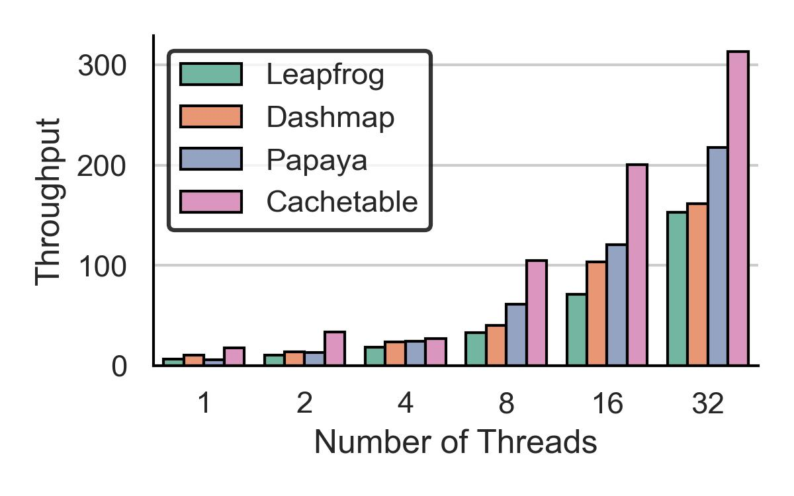

# Cachetable

`cachetable` is a high-performance lossy hash table designed for low-latency workloads.

## Usage

To include `cachetable` in your project, add it to your `Cargo.toml` from the GitHub repository:

```toml
[dependencies]
cachetable = { git = "https://github.com/mrkatebzadeh/cachetable.git" }
```

## Example

Here’s a simple example demonstrating how to use the `cachetable` crate for a key-value storage:

```rust
use cachetable::CacheTable;

fn main() {
    let key = 10;
    let value = vec![10];
    let ctable = CacheTable::<u32, Vec<u32>, 4 /* Log size */, 32 /* Bucket size*/>::new();
    ctable.insert(key, value);
    let value = ctable.get(&key);
}
```

## ShardedTable Example with Threads

Here's an example demonstrating how to use the `ShardedTable` with two shards and threads:

```rust
use cachetable::ShardedTable;
use std::{sync::Arc, thread};

fn main() {
    let table = Arc::new(ShardedTable::<u64, &str, 2, 32>::new());

    let handles = (0..2)
        .map(|shard_id| {
            let table = Arc::clone(&table);
            thread::spawn(move || {
                let shard = table.get_shard(shard_id);
                shard.register();
                shard.insert(10 * shard_id as u64, "value");
                println!("Inserted value in shard {}", shard_id);
            })
        })
        .collect::<Vec<_>>();

    for handle in handles {
        handle.join().unwrap();
    }
}
```

## Benchmark Results

The following plots showcase the performance benchmarks of Cachetable under different workloads:

### System Specifications

- **CPU**: Intel Xeon Silver 4314 x2
- **RAM**: 128 GB

### Throughput

- **Workload A (50% read, 50% write)**

  

- **Workload B (95% read, 5% write)**

  

- **Workload C (100% read)**

  

### Latency


## TODO

- [x] Implement retrieval of a key-value pair from the cache table.
- [x] Implement lock-free concurent access.
- [ ] Implement different policies for eviction.
